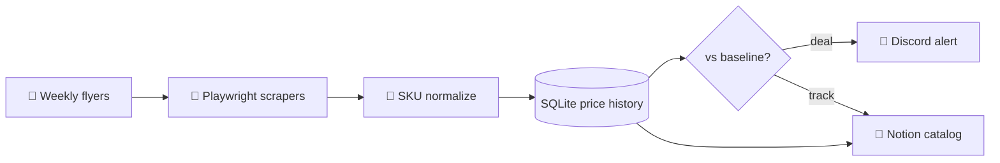

# Grocery Price Tracker

A Python-based price tracking pipeline that captures weekly grocery flyers from major chains, normalizes them into a structured catalog, compares prices against a personal baseline, and alerts on meaningful deals.

> *This repo is a public overview. The running code is private.*

---

## What it is

An automated grocery price monitor that turns unstructured weekly store flyers into a queryable price history — so "is this actually a good price?" becomes a one-line lookup instead of a guess.

## What it does

- **Scrapes weekly flyers** from multiple grocery chains (Playwright-driven, scheduled weekly)
- **Normalizes SKUs** across stores so the same item can be compared apples-to-apples
- **Tracks a catalog of 80+ watched items** with historical price curves stored in SQLite
- **Compares against a personal baseline** (warehouse-club price, historical average, or manual floor)
- **Alerts to Discord** when a watched item hits a configurable discount threshold
- **Syncs to Notion** so the shopping list, catalog, and deal alerts are all mobile-accessible

## Architecture

## Software

| Layer | Tech |
|---|---|
| Scrapers | Python, Playwright |
| Storage | SQLite (price history), Notion (catalog + UI) |
| Alerts | Discord webhooks |
| Scheduling | `launchd` (macOS cron-equivalent) |

## What this demonstrates

- **End-to-end data pipeline** — ingestion, normalization, storage, comparison, delivery
- **Notion-as-front-end** — treating a SaaS tool as the UI layer to avoid building one
- **Real-world utility** — built because "is this a deal?" was an annoying question; pipeline runs every week

## Stack

## Related in the AIOS Portfolio

- **[BMO Discord Agent](https://github.com/mikecutillo/bmo-discord-agent)** — Discord-native family AI companion; the deal-alerts channel
- **[AIOS](https://github.com/mikecutillo/aios)** — The host; Next.js dashboard orchestrating 16+ household and business modules
- **[Household Digest](https://github.com/mikecutillo/household-digest)** — AI-composed daily digest pipeline; deals surface in the morning brief

---

Part of the AIOS portfolio. See the [profile README](https://github.com/mikecutillo) for the full system map.
